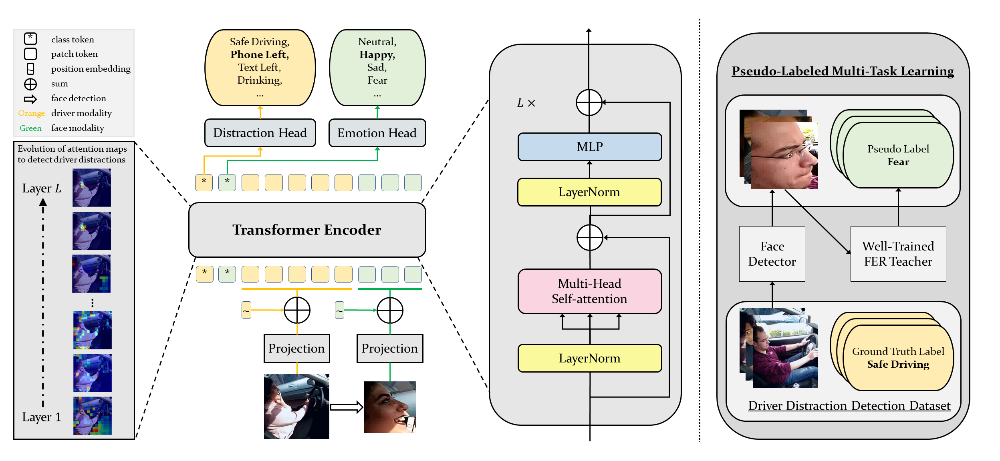

# UBC EECE571L 2022WT2 Driver Emotion Detection Proejct
## Overview
This is the repository for the team project of EECE571L. The team includes Zhe Li, Christina Sun, Charles Guan, and Jonny Wang. This project is based on the ViT-DD project as cited here:
```bibtex
@article{Ma2022MultiTaskVT,
  title={Multi-Task Vision Transformer for Semi-Supervised Driver Distraction Detection},
  author={Yunsheng Ma and Ziran Wang},
  journal={arXiv},
  year={2022}
}
```
This projects will add new features and hopefully improve the performance of the model. This readme file intends to inform the users some key points about how to use the code in the repository. 

## Prerequisites
The code in this repository requires the following package:
- Python >= 3.8
- PyTorch
- Lightning = 1.7.7
- timm
- seaborn

You are advised to run the code in a virtual environment. The yaml file named with "ViT-DD_Env" may be used to faster the virtual environment construction.  

## Dataset
The original dataset used by ViT-DD were AUCDD and SFDDD. At this point (2023-03-20), the code is not adapted for AUCDD, and there may be errors when running this code on AUCDD. However, Zhe Li has debugged the original ViT-DD code and ensured that the code is ready for SFDDD. We have also ensured the running of the model on the new dataset DMD.

For SFDDD, please put the dataset in the ./datasets folder with the following directory structure unless you want to dive into the code by yourself.
```
datasets
|-- SFDDD 
    |-- imgs
        |-- train
          |-- c0
          |-- ...
          |-- c9
            |-- img_19.jpg
            |-- ...
```
Also, the original ViT-DD used psudo labels for emotion. The data of the psudo labels should be placed in the ./psudo_emo_label with the following file directory structure.
```
pseudo_label_path
|-- AUCDD
  |-- emo_list.csv
  |-- imgs
      |-- c0
      |-- ...
      |-- c9
          |-- 0_face.jpg
          |-- ...
|-- SFDDD
  |-- emo_list.csv
  |-- imgs
      |-- img_5_face.jpg
      |-- ...
|-- emo_list.csv
|-- imgs
    |-- img_5_face.jpg
    |-- ...
```
./pseudo_label_path/emo_list.csv and ./pseudo_label_path/imgs are both copies of the same files and folders in ./pseudo_label_path/SFDDD. This is a temporary measure and we expect to improve on this problem or provide detailed intructions for how to change dataset. 

We preprocessed the DMD dataset by taking one frame per second from the videos in the DMD, and structured the dataset using the similar pattern.

## Configurations
**NOTE**: Logically, this section should come before the next section. However, you may need to read this section first, then read the next section, and finally come back to this section again.

The code uses PyTorch-Lightning for the command line interface (CLI). To fit or test our deep learning model, we need to use a YAML file to provide configuration details to the Lightning CLI. The congifuration files can be in ./configs. The vitdd_aucdd.yaml is for running the code on the AUCDD dataset, the vitdd_sfddd_sbd.yaml is to run the code on SFDDD split-by-driver, and the vitdd_sfddd_sbi.yaml is to run the code on SFDDD split-by-image. Please use the correct configuration file for your specific purpose. 

Looking into the configuration file, you should see lots of variables and values. You should pay attention to the following variables to avoid weird errors. We use vitdd_sfddd_sbd.yaml as an example. 

- save_dir: ./runs, name: vitdd/sfddd/sbd, and version:0. These three variables tell you that you should find the fitted model in the directory ./runs/vitdd/sfddd/sbd/version_0. Changing them will lead to different path of saving the fitted model, and we do not advise such change.

- max_epochs: 6. This variable tells the maximum number of epochs you want to run. We suggest using 5 or 6 if you are running on your local computer, and 20 if you are running on a powerful server. The reasoning behind the choice is how powerful your device is and how long you are willing to wait. Our executions of the code shows that the time for one epoch on RTX3060 is about 90 seconds. You can modify this variable to meet your specific purpose. If you already have a model, the value to max_epochs should be larger than the value used for that model, and the effect is running more epochs based on the existing model. For example, if you already have a model with 5 epochs, when max_epochs = 5, there will be an error; when max_epochs = 10, the fitting will start from the 6th epochs and make updates based on the existing 5-epoch model until 10 epochs. 

- accelerator: gpu. This variable specifies whether you want to run on GPU or CPU. GPU is highly recommended because CPU is very inefficient for deep learning in general. Actually, we do not advise you to run the code on your device if your device does not have a GPU better than RTX3060.

- ckpt_path: null. This variable spefies where to find the pre-trained model you already have. If this is the first time you run the code, you do not have any pre-trained model. In this case, you must use null as the value. However, if you do have an existing model either by downloading the model online or running this repository, you should use the path to that model. This requires updates if you want to test your model after finishing adding additional epochs to an existing model.

- data.batch_size: &bs 32. This variable specifies the batch size used in the training. The value should depend on the size of graphical memory your GPU has. Our experiments shows that a batch size of 32 takes about 7GB of memory. Please choose the value according to your device specification.

The configuration file for running the code on the DMD dataset is located at `./configs/vitdd_dmd.yaml`. This YAML file is similar to the one for SFDDD. See the commends in the file itself to use it for testing and training.

## Training and Testing

To fit your model, you may use the following command:

```
python train.py fit -c ./configs/<config-yaml-file-name>.yaml
```
You may choose the path to your own cofiguration file. The output of running the fitting process is be a .ckpt file, which stores weights for the fitted model. You can find it following the settings you used in the congifuration file (see the previous section for details).

To test your model, you may use the following command:
```
python train.py test -c ./configs/<config-yaml-file-name>.yaml
```
Before executing this command, please make sure that the ckpt_path variable in the configuration file is not null (see the previous section for details). The output of the testing process is a png of confusion matrix. Defaulty, the path to the confusion matrix is ./runs/vis. If the diagonal of the confusion matrix have values close to 1, then the fitting is successful.

## Extra Notes
This is a working repository. We will have frequent updates to the repo, so stay tuned. Also, the readme of the original ViT-DD repository is attached below for your convenience, but the information on it may not be correct for this repo. 

# ViT-DD: Multi-Task Vision Transformer for Semi-Supervised Driver Distraction Detection

### [paper](https://arxiv.org/abs/2209.09178)




## Abstract

Driver distraction detection is an important computer vision problem that can play a crucial role in enhancing traffic safety and reducing traffic accidents. This paper proposes a novel semi-supervised method for detecting driver distractions based on Vision Transformer (ViT). Specifically, a multi-modal Vision Transformer (ViT-DD) is developed that makes use of inductive information contained in training signals of distraction detection as well as driver emotion recognition. Further, a self-learning algorithm is designed to include driver data without emotion labels into the multi-task training of ViT-DD. Extensive experiments conducted on the SFDDD and AUCDD datasets demonstrate that the proposed ViT-DD outperforms the best state-of-the-art approaches for driver distraction detection by 6.5% and 0.9%, respectively. 

## Results

|                      Experiments                      | Accuracy |  NLL   |                                                            Checkpoints                                                            |
| :---------------------------------------------------: | :------: | :----: | :-------------------------------------------------------------------------------------------------------------------------------: |
|           [AUCDD](configs/vitdd_acudd.yaml)           |  0.9359  | 0.2399 |     [link](https://purdue0-my.sharepoint.com/:u:/g/personal/yunsheng_purdue_edu/EbRPfyR5QWpNjrF5jbuY5y0BXfBk4FRr0mNSYLKDMqIYYw?e=FhP7fB)      |
| [SFDDD split-by-driver](configs/vitdd_sfddd_sbd.yaml) |  0.9251  | 0.3900 | [link](https://purdue0-my.sharepoint.com/:u:/g/personal/yunsheng_purdue_edu/EVxQRFho80VBl_WtP4XKcTUBpMdMDczu-EmlNSN-lXm86Q?e=gNYfxD) |
| [SFDDD split-by-image](configs/vitdd_sfddd_sbi.yaml)  |  0.9963  | 0.0171 | [link](https://purdue0-my.sharepoint.com/:u:/g/personal/yunsheng_purdue_edu/Ea8r8Nnz3B1MgIKGjnX09T4B78bgU1x2woEok_FGbsqVnQ?e=4zNQw0) |

## Usage

### Prerequisites

The code is built with following libraries:

- Python >= 3.8
- [PyTorch](https://pytorch.org/)
- [Lightning](https://www.pytorchlightning.ai/)
- [timm](https://github.com/rwightman/pytorch-image-models)
- [seaborn](https://seaborn.pydata.org/index.html)

To make sure that your PyTorch is using GPU. Please write and execute the following python file:

```
import torch
import torch
print(torch.cuda.is_available()) # Should print True
print(torch.cuda.device_count()) # see how many gpus are available to you. If you only have one gpu, should print 1.
print(torch.cuda.current_device()) # see which gpu you are using. If you only have one gpu, should print 0.
```

### Data Preparation

Please organize the data using the directory structures listed below:

```
data_root
|-- AUCDD
    |-- v2
        |-- cam1
            |-- test
            |-- train
              |-- c0
              |-- ...
              |-- c9
                |-- 188.jpg
                |-- ...
|-- SFDDD 
    |-- imgs
        |-- train
          |-- c0
          |-- ...
          |-- c9
            |-- img_19.jpg
            |-- ...
```

```
pseudo_label_path
|-- AUCDD
  |-- emo_list.csv
  |-- imgs
      |-- c0
      |-- ...
      |-- c9
          |-- 0_face.jpg
          |-- ...
|-- SFDDD
  |-- emo_list.csv
  |-- imgs
      |-- img_5_face.jpg
      |-- ...

```

We provide our generated pseudo emotion labels as well as cropped images of drivers' faces for the AUCDD and SFDDD datasets [here](https://purdue0-my.sharepoint.com/:u:/g/personal/yunsheng_purdue_edu/EUpgT82VdpNEir_ck5lo4hEBBOPv8ymK6sze0fhMXMKsdw?e=1tMfhn).

## Citation

If you find ViT-DD beneficial or relevant to your research, please kindly recognize our efforts by citing our paper:

```bibtex
@article{Ma2022MultiTaskVT,
  title={Multi-Task Vision Transformer for Semi-Supervised Driver Distraction Detection},
  author={Yunsheng Ma and Ziran Wang},
  journal={arXiv},
  year={2022}
}
```
